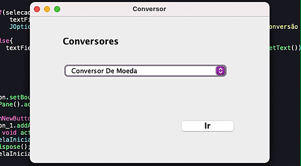
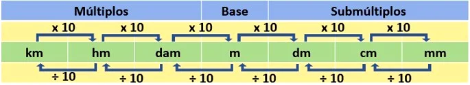

# Challenge Oracle

###### Foi solicitado o desenvolvimento de um conversor de moedas em Java, utilizando a biblioteca Swing e criando telas. Durante o desenvolvimento do projeto, utilizamos o [Trello](https://trello.com/b/UzATeQZG/conversor-de-moeda-challenge-one-java-sprint-01) como uma ferramenta de gerenciamento, permitindo criar painéis virtuais para organizar e acompanhar as tarefas restantes de forma eficiente.

#### Exemplo demonstrado

#### Conversor Entregue 

- Conversor de Moedas
- Conversor de Medidas

#### Conversor de Moedas

- Foi usado API Cotacões [AwesomeAPI](https://docs.awesomeapi.com.br) para extrair o valor base para conversão 

#### Conversor de Medidas

